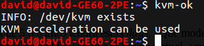

## Ejercicios Hito1

### Ejercicio 1
**Consultar en el catálogo de alguna tienda de informática el precio de un ordenador tipo servidor y calcular su coste de amortización a cuatro y siete años. Consultar este artículo en Infoautónomos sobre el tema.**  
He elegido este servidor: [Dell PowerEdge R430](http://www.dell.com/es/empresas/p/poweredge-r430/pd?oc=dsper430&model_id=poweredge-r430)  
Tiene un precio de 4862 (euros sin IVA).  
- Para un coste de amortización de 4 años tenemos que:
4862 € / 4 años = 1215,5 €/año   
- Para un coste de amortización de 7 años tenemos que:
4862 € / 7 años = 694,57 €/año  

### Ejercicio 2
**Usando las tablas de precios de servicios de alojamiento en Internet “clásicos”, es decir, que ofrezcan Virtual Private Servers o servidores físicos, y de proveedores de servicios en la nube, comparar el coste durante un año de un ordenador con un procesador estándar (escogerlo de forma que sea el mismo tipo de procesador en los dos vendedores) y con el resto de las características similares (tamaño de disco duro equivalente a transferencia de disco duro) en el caso de que la infraestructura comprada se usa sólo el 1% o el 10% del tiempo.**  
He comparadao la opcion [VPS 4 de Arsys](https://www.arsys.es/servidores/vps?s=cpc&c=316967523&a=19256490003&gclid=CjwKEAjwu7LOBRDZ_MOHmpW6kW8SJABC19sY7NZDxQiYKiEFKNqbyc0JNWiLpuct0ck4DxJzyXIB-BoCBHLw_wcB) con el servidor [Lenovo ThinkStation E32](http://www.ebay.es/itm/Lenovo-ThinkStation-E32-SFF-Xeon-e3-1230v3-3-3ghz-8gb-RAM-128gb-SSD-K600-/372061303478?_trksid=p2141725.m3641.l6368).  
El servicio de Arsys tiene las caracteristicas de 4 CPU Xeon, 8GB de RAM y con 100GB de disco SSD.  
El servidor Lenovo tiene similares, 4 CPU Xeon, 8GB de RAM y 100GB de disco SSD.  
El precio del servicio de Arsys es de 40 €/mes, por lo que al año nos cuesta *480€*, mientras el servidor vale *353€*.  

### Ejercicio 3
**En general, cualquier ordenador con menos de 5 o 6 años tendrá estos flags. ¿Qué modelo de procesador es? ¿Qué aparece como salida de esa orden? Si usas una máquina virtual, ¿qué resultado da? ¿Y en una Raspberry Pi o, si tienes acceso, el procesador del móvil?**
- Intel(R) Core(TM) i7-4710HQ CPU @ 2.50GHz
- Tras ejecutar egrep '^flags.*(vmx|svm)' /proc/cpuinfo me muestra:

### Ejercicio 4
1. **Comprobar si el núcleo instalado en tu ordenador contiene este módulo del kernel usando la orden kvm-ok.**

2. **Instalar un hipervisor para gestionar máquinas virtuales, que más adelante se podrá usar en pruebas y ejercicios.**
\-  

### Ejercicio 5
**Darse de alta en servicios de nube usando ofertas gratuitas o cupones que pueda proporcionar el profesor.**
\-  

### Ejercicio 6
**Darse de alta en una web que permita hacer pruebas con alguno de los sistemas de gestión de nube anteriores.**
\-  
