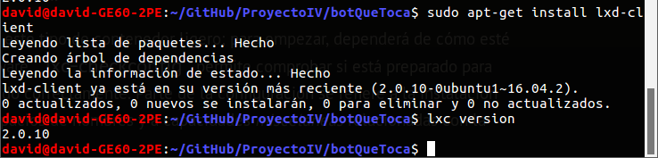
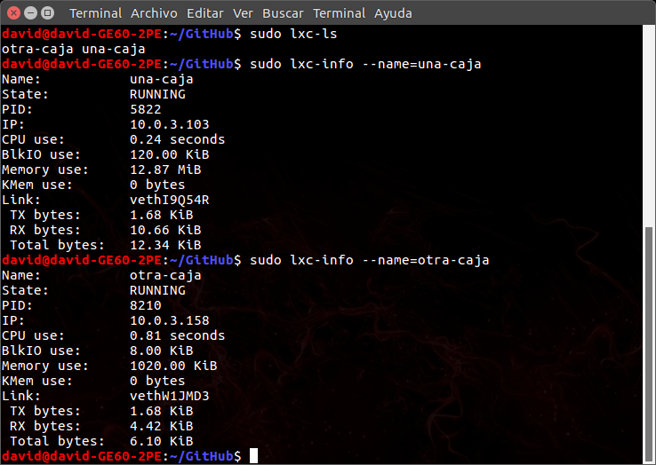
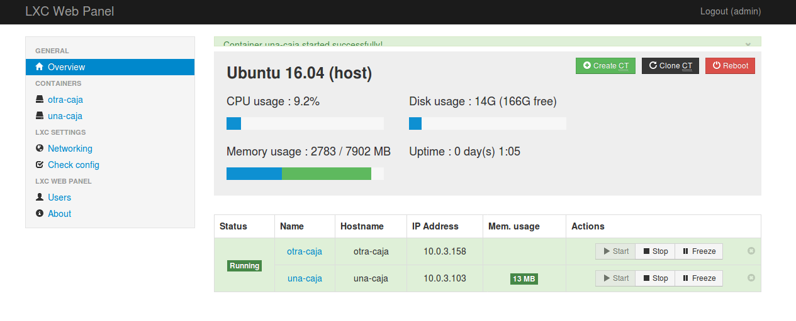
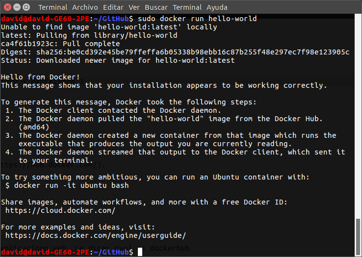
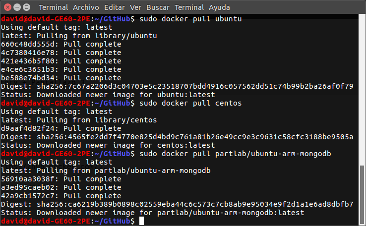
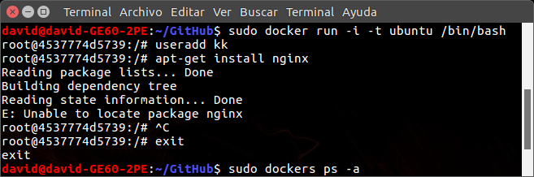
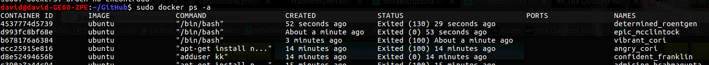

## Ejercicios Hito4

### Ejercicio 1
**Instala LXC en tu versión de Linux favorita. Normalmente la versión en desarrollo, disponible tanto en GitHub como en el sitio web está bastante más avanzada; para evitar problemas sobre todo con las herramientas que vamos a ver más adelante, conviene que te instales la última versión y si es posible una igual o mayor a la 1.0.**
Solo hay que hacer el primer comando de la imagen:

### Ejercicio 2
**Crear y ejecutar un contenedor basado en tu distribución y otro basado en otra distribución, tal como Fedora. Nota En general, crear un contenedor basado en tu distribución y otro basado en otra que no sea la tuya.**

### Ejercicio 3
**Instalar docker.**
Usamos la guía:  
https://docs.docker.com/engine/installation/linux/docker-ce/ubuntu/#install-using-the-repository

### Ejercicio 4
**1. Instalar a partir de docker una imagen alternativa de Ubuntu y alguna adicional, por ejemplo de CentOS.  
2. Buscar e instalar una imagen que incluya MongoDB**
Ejecutamos los comandos:
~~~
$ sudo docker pull ubuntu
$ sudo docker pull centos
$ sudo docker pull partlab/ubuntu-arm-mongodb
~~~

### Ejercicio 5
**Crear un usuario propio e instalar alguna aplicación tal como nginx en el contenedor creado de esta forma, usando las órdenes propias del sistema operativo con el que se haya inicializado el contenedor.**
Ejecutamos:

### Ejercicio 6
**Crear a partir del contenedor anterior una imagen persistente con commit.**
Buscamos ID del contenedor deseado:
~~~
$ sudo docker ps -a
~~~

Creamos la nueva imagen llamada `nuevo-nombre`, seleccionando el ID del contenedor deseado:
~~~
$ sudo docker commit <ID contenedor> <nombre>
~~~
Y como vemos en la imagen se ha creado:

### Ejercicio 7
**Crear un Dockerfile para el servicio web que se ha venido desarrollando en el proyecto de la asignatura.**
El contenido del archivo Dockerfile contiene:
~~~
FROM python:3

MAINTAINER David Sánchez Montés <anixo.a.tope@gmail.com>

RUN mkdir -p /usr/src/app
WORKDIR /usr/src/app

COPY requirements.txt /usr/src/app/
RUN pip install --no-cache-dir -r requirements.txt

COPY . /usr/src/app

EXPOSE 80
CMD [ "hug",  "-p 80", "-f","./botQueToca/hugweb.py" ]
~~~

### Ejercicio 8
**Desplegar un contenedor en alguno de estos servicios, de prueba gratuita o gratuitos.**
URL de Docker Hub: https://hub.docker.com/r/anixo/proyectoiv/
Contenedor: https://proyectoiv-frymrirpfw.now.sh/
