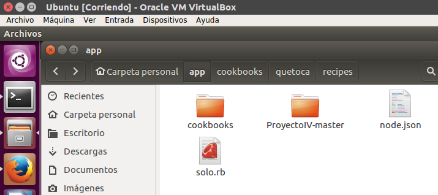

## Ejercicios Hito5, gestion de configuraciones

### Ejercicio 1
**Instalar chef-solo en la máquina virtual que vayamos a usar**
Ejecutamos los siguientes comandos:
~~~
$ sudo apt-get install ruby ruby-dev
$ sudo gem install chef
~~~
  

### Ejercicio 2
**Crear una receta para instalar la aplicación que se viene creando en la asignatura en alguna máquina virtual o servidor en la nube.**  
Creamos el archivo *solo.rb* con el siguiente contenido:  
~~~
file_cache_path "/home/usuario/app"
cookbook_path "/home/usuario/app/cookbooks"
json_attribs "/home/usuario/app/node.json"
~~~
Creamos el archivo *node.js* con el siguiente contenido:  
~~~
{
	"run_list": [ "recipe[quetoca]" ]
}
~~~
Estos archivos van en la carpeta principal:
  
Creamos el archivo *default.rb* con el siguiente contenido:  
~~~
system('apt-get install python')
system('apt-get install python-pip')
system('pip install -r /home/usuario/app/ProyectoIV-master/requirements.txt')
system('hug -p 80 -f /home/usuario/app/ProyectoIV-master/botQueToca/hugweb.py')
~~~
Este archivo va en la ruta de la imagen:  
  
Lo ejecutamos con:  
~~~
$ sudo chef-solo -c chef/solo.rb
~~~

### Ejercicio 3
**Desplegar la aplicación de DAI con todos los módulos necesarios usando un playbook de Ansible.**  
No he cursado DAI.  

### Ejercicio 4
**Instalar una máquina virtual Debian usando Vagrant y conectar con ella.**  
Añadimos la distribución deseada:  
~~~
$ vagrant box add https://app.vagrantup.com/debian/boxes/jessie64
~~~
Creamos el archivo Vagrantfile:  
~~~
$ vagrant init
~~~
Y lo editamos:  
  
Levantamos la maquina y nos conectamos:  
~~~
$ vagrant up
$ vagrant ssh
~~~
  

### Ejercicio 5
**Crear un script para provisionar nginx o cualquier otro servidor web que pueda ser útil para alguna otra práctica.**  
Editamos el archivo Vagrantfile con:
~~~
Vagrant.configure(2) do |config|
  config.vm.box = "debian/jessie64"
  config.vm.provision "shell", inline: "sudo apt-get -y install nginx"
end
~~~
  
Levantamos la maquina y la provisionamos:
~~~
$ vagrant up
$ vagrant provision
~~~
Y como vemos esta instalado
  

### Ejercicio 6
**Configurar tu máquina virtual usando vagrant con el provisionador chef.**  
El arbol de directorios es como el del ejercicio2, tan solo configuramos el archivo:  
  
