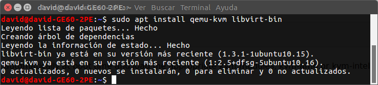
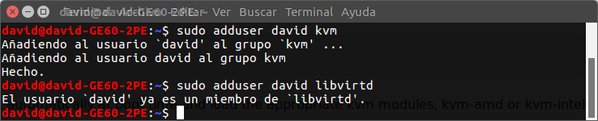
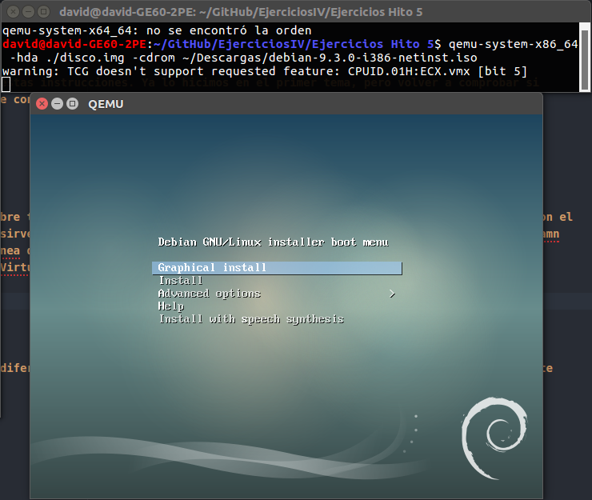
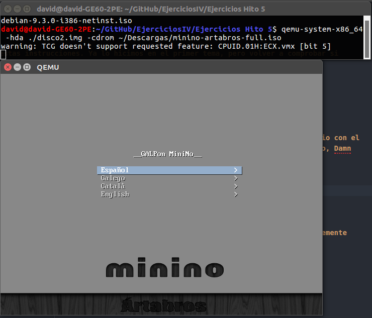
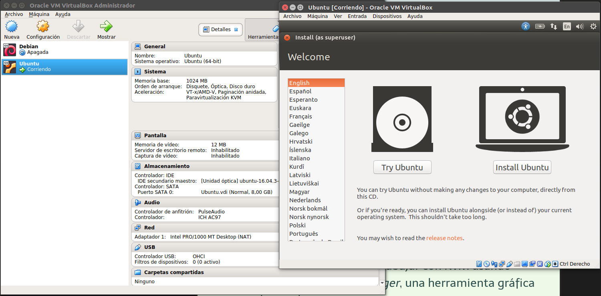
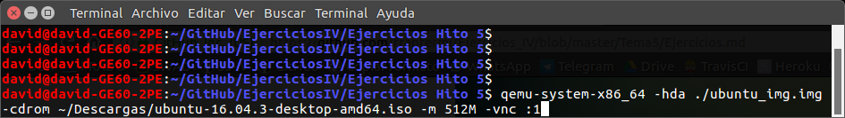
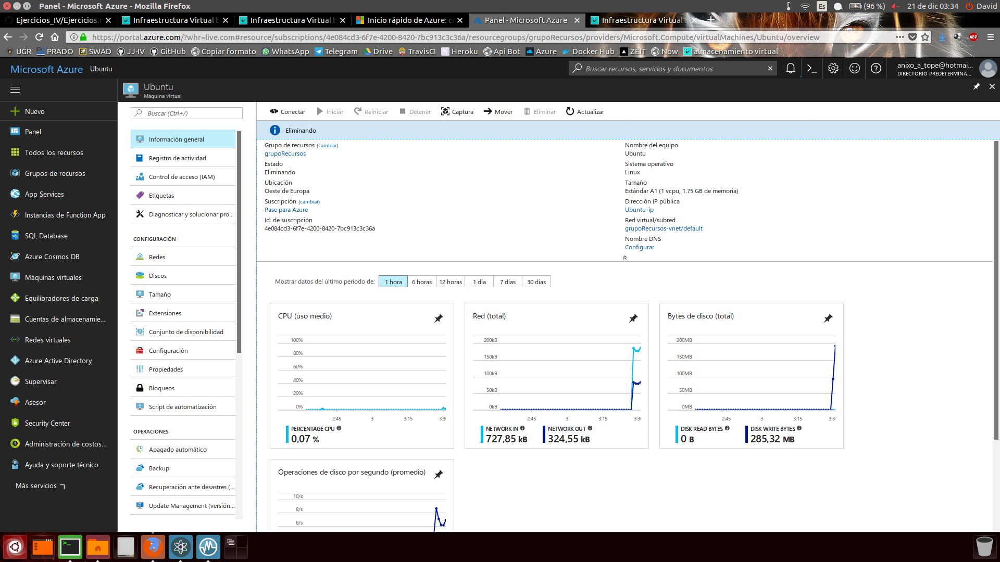
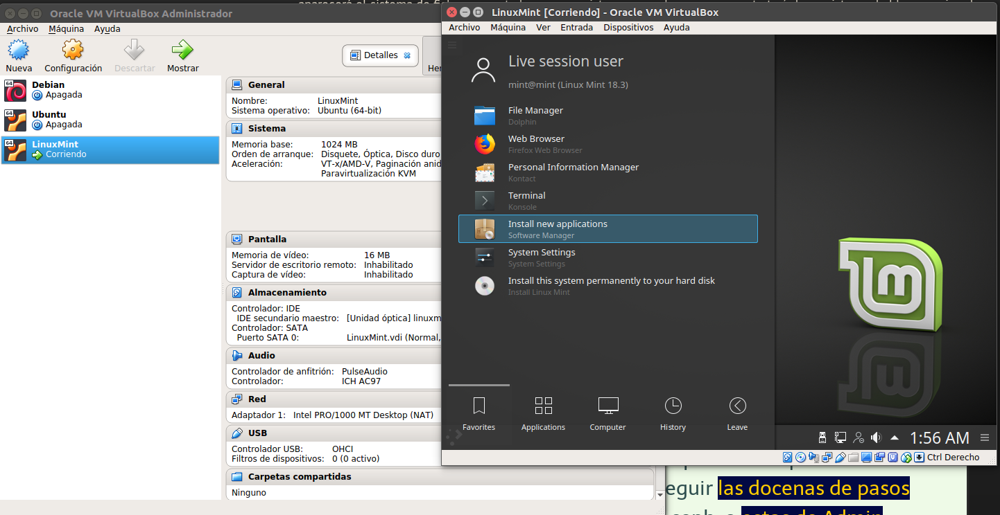

## Ejercicios Hito5, uso de sistemas

### Ejercicio 1
**Instalar los paquetes necesarios para usar KVM. Se pueden seguir estas instrucciones. Ya lo hicimos en el primer tema, pero volver a comprobar si nuestro sistema está preparado para ejecutarlo o hay que conformarse con la paravirtualización.**  
Ejecutamos los comandos:  
~~~
$ sudo apt-get install qemu-kvm libvirt-bin
~~~

### Ejercicio 2
**1. Crear varias máquinas virtuales con algún sistema operativo libre tal como Linux o BSD. Si se quieren distribuciones que ocupen poco espacio con el objetivo principalmente de hacer pruebas se puede usar CoreOS (que sirve como soporte para Docker) GALPon Minino, hecha en Galicia para el mundo, Damn Small Linux, SliTaz (que cabe en 35 megas) y ttylinux (basado en línea de órdenes solo).  
2. Hacer un ejercicio equivalente usando otro hipervisor como Xen, VirtualBox o Parallels.**  
Para el apartado 1:  
Ejecutamos los comandos:  
~~~
$ qemu-img create -f qcow2 disco.img 500M
~~~

  
Para el apartado 2:  

### Ejercicio 3
**Crear un benchmark de velocidad de entrada salida y comprobar la diferencia entre usar paravirtualización y arrancar la máquina virtual simplemente con: qemu-system-x86_64 -hda /media/Backup/Isos/discovirtual.img**  
\-

### Ejercicio 4
**Crear una máquina virtual Linux con 512 megas de RAM y entorno gráfico LXDE a la que se pueda acceder mediante VNC y ssh.**  
Ejecutamos el comando, aunque hemos elegido ubuntu por comodidad, se podría hacer usando una ISO de un sistema operativo con LXDE:  

### Ejercicio 5
**Crear una máquina virtual ubuntu e instalar en ella alguno de los servicios que estamos usando en el proyecto de la asignatura.**  
He seguido el siguiente tutorial: https://docs.microsoft.com/es-es/azure/virtual-machines/linux/quick-create-portal?toc=%2Fazure%2Fvirtual-machines%2Flinux%2Ftoc.json  

### Ejercicio 6
**Instalar una máquina virtual con Linux Mint para el hipervisor que tengas instalado.**  
Como vemos en la imagen:  

